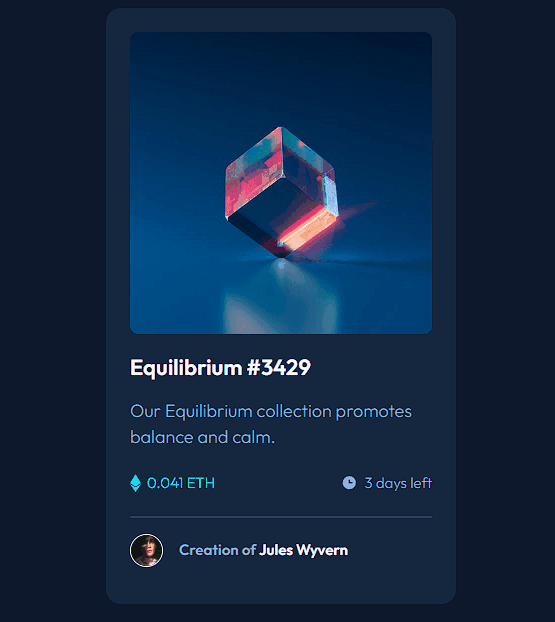

# Frontend Mentor - NFT preview card component solution

This is a solution to the [NFT preview card component challenge on Frontend Mentor](https://www.frontendmentor.io/challenges/nft-preview-card-component-SbdUL_w0U). Frontend Mentor challenges help you improve your coding skills by building realistic projects.

## Table of contents

- [Overview](#overview)
  - [The challenge](#the-challenge)
  - [Screenshot](#screenshot)
  - [Links](#links)
- [My process](#my-process)
  - [Built with](#built-with)
  - [What I learned](#what-i-learned)
  - [Continued development](#continued-development)
  - [Useful resources](#useful-resources)
- [Author](#author)

## Overview

### The challenge

Users should be able to:

- View the optimal layout depending on their device's screen size
- See hover states for interactive elements

### Screenshot

### Links

- Solution URL: https://github.com/jisazamp/nft-preview-card-component
- Live Site URL: https://jisazamp.github.io/nft-preview-card-component/

## My process

### Built with

- Semantic HTML5 markup
- CSS custom properties
- Flexbox
- Mobile-first workfl

### What I learned

The difficulty I encountered in this challenge was to place the overlay for the states in the image. Fortunately, the W3 documentation was very clear in order to implement this point.

### Continued development

As I mentioned before, I want to strengthen my CSS skills when I have to have an overlay or a backdrop. I think this was a good opener.

### Useful resources

- [CSS Image Overlay](https://www.w3schools.com/howto/howto_css_image_overlay.asp) - This helped me to implement the image overlay.

## Author

- Github - [Juan Pablo Isaza](https://github.com/jisazamp)
- Frontend Mentor - [@jisazamp](https://www.frontendmentor.io/profile/jisazamp)
